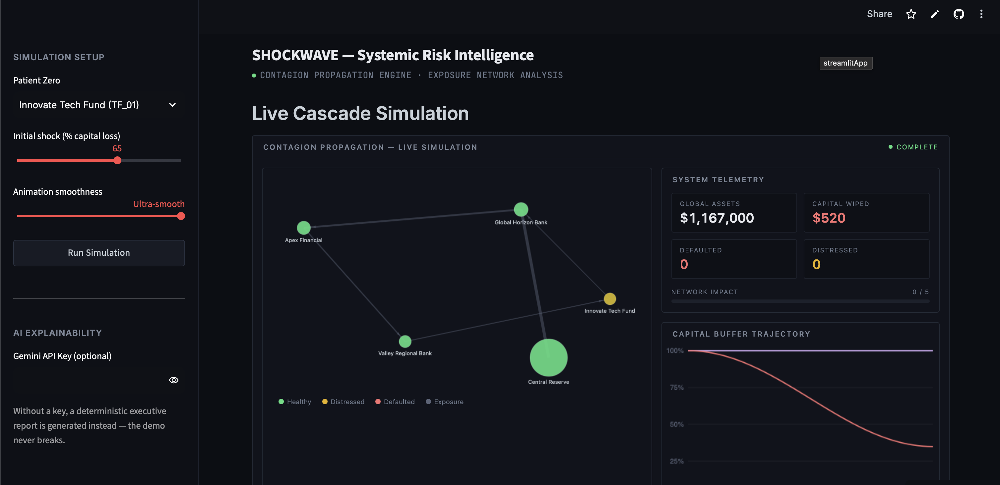
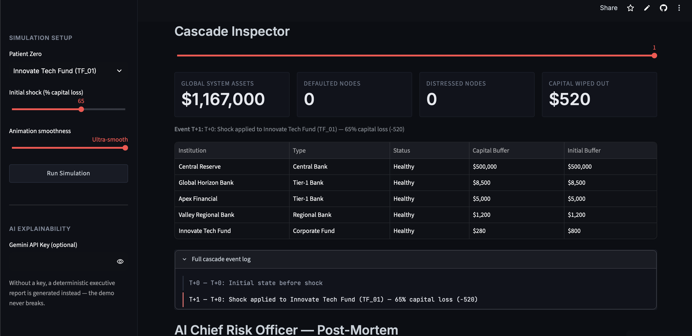

# SHOCKWAVE — Financial Shock Propagation Simulator

Built for **Turing Hacks 4.0**.

A directed-graph simulator that models how a capital shock to one financial
institution cascades through a network of interconnected exposures — banks,
central banks, and corporate funds linked by loans, credit lines, and bonds.

> One institution defaults on its obligations. Its creditors take the loss
> on their books. If that loss is big enough, *they* default too, and the
> failure keeps propagating outward — this is what actually happened in
> 2008, compressed into a live, interactive simulation.

<!-- Screenshots: overview + a mid-cascade / AI report view -->



## What it actually does

1. **You define a financial network** as a directed graph (`data/institutions.json`)
   — nodes are institutions with a capital buffer and total assets, edges are
   exposures (who owes what to whom, and what instrument it's in).
2. **You trigger a shock** — pick a "patient zero" institution and a
   percentage of its capital buffer to wipe out.
3. **The engine propagates it recursively**: if a node's buffer hits zero, it
   defaults. Every creditor with an edge into that node must then write down
   the *full exposure amount* against their own buffer. That write-down can
   itself trigger distress or default, which cascades further, until the
   system stabilizes (no new defaults in a full pass).
4. **Every discrete event is recorded** as a deep-copied graph snapshot, so
   the full cascade can be replayed step by step or animated smoothly.
5. **An AI "Chief Risk Officer"** (Gemini `gemini-2.5-flash`) reads the
   before/after network state and writes a 3-paragraph executive
   post-mortem. If there's no API key or the call fails, a deterministic
   fallback report is generated instead — the demo can't crash from a
   network hiccup mid-presentation.

## Why this is a graph problem, not a spreadsheet problem

Systemic risk isn't additive — you can't just sum up "how much money did
everyone lose." A default at one node changes the *effective* exposure
everyone else is carrying, which changes who else is at risk, which can
loop back and affect institutions several hops away from the original
shock. Modeling it as a `networkx.DiGraph` and walking `in_edges` on each
newly-defaulted node is what makes that propagation computable instead of
guessed at.

## Architecture

```
shockwave/
├── data/institutions.json        # network topology: nodes + exposure edges
├── core/
│   ├── network_builder.py        # JSON -> networkx.DiGraph
│   └── contagion_engine.py       # shock injection + recursive cascade logic
├── api/
│   └── explainability.py         # Gemini post-mortem generator + deterministic fallback
└── ui/
    ├── app.py                    # Streamlit dashboard
    ├── simulation_data.py        # static layout + eased frame interpolation
    └── simulation_component.py   # self-contained client-side canvas animation
```

The visualization is split deliberately: `simulation_data.py` precomputes
the entire animation trajectory once in Python (fixed node layout, eased
interpolation between cascade events), and `simulation_component.py` embeds
that as a single HTML/Canvas/JS component that animates itself in the
browser via `requestAnimationFrame`. The animation loop never touches
Streamlit — that's what keeps it smooth instead of stepping through
server-rendered frames.

## Setup

```bash
git clone https://github.com/divye936/financial-shockwave-simulator.git
cd financial-shockwave-simulator
python3 -m venv venv
source venv/bin/activate      # Windows: venv\Scripts\activate
pip install -r requirements.txt
streamlit run ui/app.py
```

Optional: paste a Gemini API key into the sidebar for live AI-generated
post-mortems. Not required — the app works fully without one.

## Known limitations / what we'd build next

- The network topology is a single hardcoded JSON file. A real version
  would ingest actual interbank exposure data (e.g. from public regulatory
  stress-test datasets) instead of five illustrative institutions.
- Write-downs currently assume 100% loss-given-default on the full
  exposure amount. A more realistic model would apply a recovery rate
  (e.g. creditors recover 40-60% of exposure, not zero).
- No persistence — every simulation run starts from the same baseline
  network state, so there's no way to compare scenarios side by side yet.
- The contagion engine is single-threaded and re-walks the full node list
  each pass; fine at this scale (5 nodes), would need optimization for a
  network with hundreds of institutions.

## License

MIT — see [LICENSE](LICENSE).
